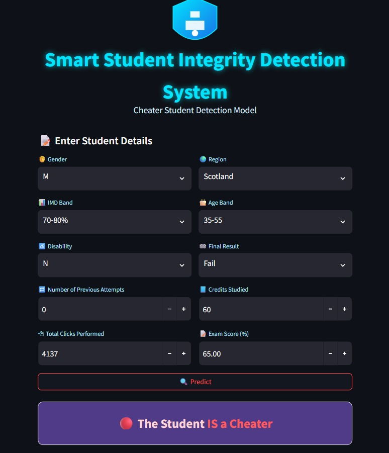
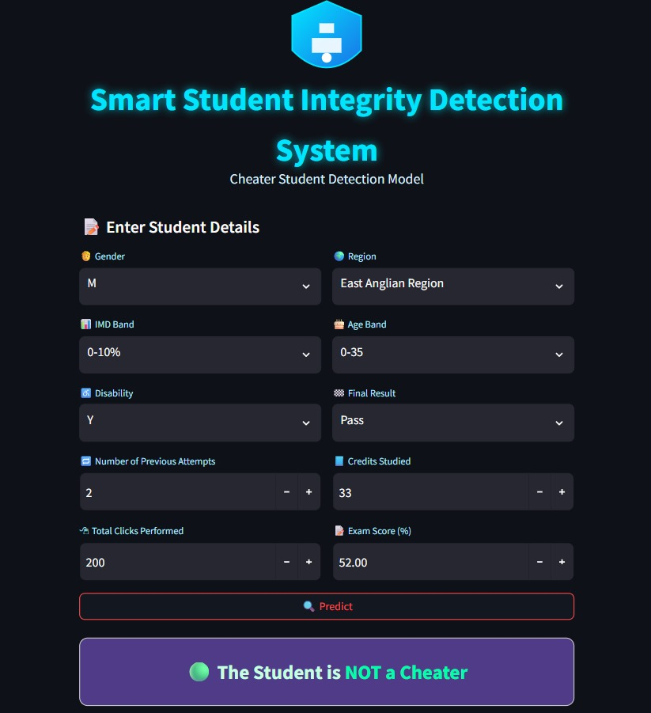

# Cheater_Student_Detection_ML_Project
This repo contain the project of Cheater Student Detection Using Machine Learning, with a detail Preprocessing from converting Real world raw data to Clean and building  a final trained model  having a good Interface with Streamlit library.

# Smart Student Integrity Detection System

An end-to-end machine learning project to identify students exhibiting anomalous (potential cheating) behaviors based on their interactions with a Virtual Learning Environment (VLE) and assessment data. The project culminates in an interactive web application built with Streamlit for real-time predictions.

---

## 🚀 Live Demo & Preview

This repository includes a Streamlit application (`app.py`) to demonstrate the model in action. Below is a preview of the user interface:

*(**Note:** You can create a quick screen recording of your app and convert it to a GIF. Then, upload it to your repository and replace the line above with `)*

---

## 📖 Project Overview

The primary goal of this project is to detect students who display anomalous patterns in their learning and assessment behavior, which could indicate academic dishonesty.

The core challenge is that the dataset does not come with a pre-labeled "cheater" column. Therefore, this project takes an unsupervised approach to *create* this target variable first. "Cheating" is defined as a behavioral anomaly.

### The Workflow:
1.  **Data Ingestion & Merging:** Combine three separate data sources (`studentInfo`, `studentVle`, `studentAssessment`) into a single, unified dataset.
2.  **Advanced Feature Engineering:** Aggregate over 10 million VLE interaction logs to create meaningful features like total `sum_click` per student.
3.  **Missing Value Imputation:** Employ a machine learning model (Random Forest) to intelligently predict and fill 9,300+ missing values in the `imd_band` column, achieving **85.5% imputation accuracy**.
4.  **Target Variable Creation (Anomaly Detection):** Use an **Isolation Forest** algorithm to scan the data for anomalies. Students flagged as anomalies (the top 0.5% or `contamination=0.005`) are labeled as potential cheaters (`is_cheater = 1`).
5.  **Model Training:** Train a **Random Forest Classifier** on this newly labeled dataset to learn the complex patterns that distinguish anomalous students from non-anomalous ones.
6.  **Deployment:** Build an interactive Streamlit web application to serve the trained model and make predictions on new, unseen student data.

---

## 🛠️ Key Methodologies & Pipeline

This project is broken down into two main phases, detailed in their respective notebooks.

### 1. Data Preprocessing & Anomaly Detection
(`Data_Preprocessing.ipynb`)

This notebook is the foundation of the project. Its sole purpose is to clean the raw data and generate the target variable (`is_cheater`).

* **Data Sources:**
    * `studentInfo.csv`: (32,593 records) Demographic data for each student.
    * `studentVle.csv`: (10,655,280 records) Logs of student interactions with the VLE.
    * `studentAssessment.csv`: (173,912 records) Student assessment submission data and scores.
* **Feature Engineering:** The 10.6M VLE logs were aggregated by `id_student` to create `sum_click`, representing a student's total engagement.
* **Data Merging:** The three tables were merged into a final dataframe of 207,242 records.
* **Advanced Imputation:**
    * The `imd_band` (Index of Multiple Deprivation) column had 9,314 missing values.
    * Instead of simple imputation (like using the mode), a `RandomForestClassifier` was trained on the non-null data to predict the missing `imd_band` values based on other features. This predictive model achieved **85.54% accuracy** on its test set.
* **Target Variable Creation:**
    * An **Isolation Forest** model was used for anomaly detection. This unsupervised model is effective at identifying rare and unusual data points.
    * A `contamination` rate of **0.5%** was set, meaning the 1,033 most anomalous students in the dataset were flagged as `is_cheater = 1`.
* **Final Output:** A clean, processed file (`Student_Clean_Data.csv`) ready for supervised learning.

### 2. Model Training & Pipeline
(`Model_Training_File.ipynb`)

This notebook uses the clean data to build a robust classification model.

* **Feature Selection:** Dropped `highest_education` as it was less relevant after imputation and anomaly detection.
* **Preprocessing Pipeline:** A `ColumnTransformer` and `Pipeline` were built to ensure no data leakage and that all transformations are applied consistently.
    * **Categorical Features:** `gender`, `region`, `imd_band`, `age_band`, `disability`, `final_result` were processed with `OrdinalEncoder()`.
    * **Numerical Features:** `num_of_prev_attempts`, `studied_credits`, `sum_click`, `score` were scaled using `StandardScaler()`.
* **Model Selection:** A **Random Forest Classifier** (`n_estimators=100`) was chosen for its high performance and robustness with mixed data types.
* **Train/Test Split:** The data was split 80/20. Crucially, `stratify=y` was used to ensure the rare `is_cheater` class (0.5%) was present in both the training and testing sets in its original proportion.

---

## 📊 Model Performance

The model's performance is high, but it's essential to look beyond the overall accuracy due to the severe class imbalance.

* **Overall Accuracy:** **99.57%**

The classification report provides a clearer picture, especially for the "Cheater" (Class 1) category.

| Class | Precision | Recall | F1-Score | Support |
| :--- | :---: | :---: | :---: | :---: |
| **0 (Non-Cheater)** | 1.00 | 1.00 | 1.00 | 41,151 |
| **1 (Cheater)** | 0.60 | 0.40 | 0.48 | 207 |
| | | | | |
| **Macro Avg** | 0.80 | 0.70 | 0.74 | 41,358 |
| **Weighted Avg** | 1.00 | 1.00 | 1.00 | 41,358 |

**Interpretation:**
* **Precision (0.60):** When the model predicts a student is a cheater, it is correct 60% of the time.
* **Recall (0.40):** The model successfully identifies 40% of all actual cheaters (anomalies) in the test set.

Given that the "cheater" class was defined by an unsupervised algorithm and represents only 0.5% of the data, these results are promising and establish a strong baseline for identifying at-risk students.

